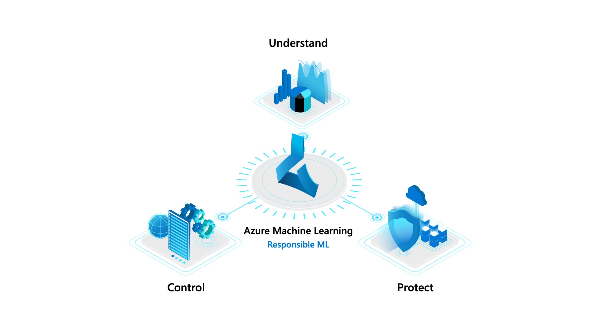
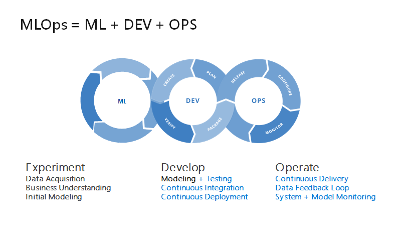

---
languages:
  - python
products:
  - Azure Machine Learning Service
description: "Detect Parkinson Symptoms"
---



# Detect Parkinson Symptoms
# Introduction

This repository wishes to show how using the latest machine learning features in Azure Machine Learning and Microsoft open-source toolkits we can put the mlops principles into practice.

These tools empower data scientists and developers to understand ML models, protect people and their data, and control the end-to-end ML process. 

For this, we will develop a solution that wishes to detect if a person is suitable for receiving treatment for parkinson or not. This example ilustrates how to put the mlops principles into practice throughout the different stages of Machine Learning pipeline (Preprocessing, Training/Evaluation, Register Model).

# Why use Azure Machine Learning Service?

Azure Machine Learning Service give to use the capability to use MLOps techniques, it empowers data scientists and app developers to help bring ML models to production.

This MLOps functionalities that Azure Machine Learning have, enables you to track / version / audit / certify / re-use every asset in your ML lifecycle and provides orchestration services to streamline managing this lifecycle.


## What are the key challenges we wish to solve with MLOps?



**Model reproducibility & versioning**

- Track, snapshot & manage assets used to create the model
- Enable collaboration and sharing of ML pipelines

**Model packaging & validation**

- Support model portability across a variety of platforms
- Certify model performance meets functional and latency requirements

**Model auditability & explainability**

- Maintain asset integrity & persist access control logs
- Certify model behavior meets regulatory & adversarial standards

# Getting started

The solution has this structure:

```
.
├── dataset
│
├── docs (documentation images)
├── infrastructure
│   ├── Scripts
│   │    └── Deploy-ARM.ps1
│   ├── deployment.json
│   ├── DeployUnified.ps1
│   └── README.md
├── src
│   ├── mlops-pipeline
│   ├── notebooks-settings
│   └── utils
├── .gitignore
└── README.md
```

To run this sample you have to do this steps:

1. **Create infrastructure**
2. **Run notebook to install dependencies**
4. **Publish the pipeline**
5. **Submit pipeline using API**

## 1. Create infrastructure

We need a infrastructure in Azure to run the experiment. You can read more about the necessary infrastructure [here](./infrastructure/README.md).

To facilitate the task of creating the infrastructure, you can run the `infrastructure/DeployUnified.ps1` script. You have to indicate the **Resource Group**, the **Location** and the **Suscription Id**.

## 2. Install Project dependencies

### Virtual environments to execute Azure Machine Learning notebooks

### Ananconda and Jupyter Notebook Local

To create the virual environment, we need to have anaconda installed in our computer. It can be downloaded in this [link](https://www.anaconda.com/download/)

- Instalation: https://www.anaconda.com/distribution/

In this project we have inside src folder many directories with jupyter notebook that you have to execute to obtain and complete the objective of this repository.
The folder src have:

1. **mlops pipelines:**
   1. mlops-publish-pipeline.ipynb
   2. mlops-submit-pipeline.ipynb
   3. environment.yml

You must execute the following commands before do anything inside these notebooks. For each one do the follwing cmd lines:

- **Conda commands to create local env by environment.yml:** `conda env create -f environment.yml`
- **Set conda env into jupyter notebook:** `python -m ipykernel install --user --name <environment_name> --display-name "Python (<environment_name>)"`

## 3. Publish the pipeline

Run `src/mlops-pipeline/mlops-publish-pipeline.ipynb` to create a machine learning service pipeline with Responsible AI steps and MLOps techniques that runs jobs unattended in different compute clusters.

You can see the runs pipelines in the Azure portal.


## 4. Submit pipeline using API Rest 

Run `src/mlops-pipeline/mlops-submit-pipeline.ipynb` to execute/invoke this published pipeline via REST endpoint.

You can see the runs pipelines in the Azure portal.


# References

- [Azure Machine Learning(Azure ML) Service Workspace](https://docs.microsoft.com/en-us/azure/machine-learning/service/overview-what-is-azure-ml)
- [Azure ML CLI](https://docs.microsoft.com/en-us/azure/machine-learning/service/reference-azure-machine-learning-cli)
- [Azure Responsible AI](https://azure.microsoft.com/es-es/blog/build-ai-you-can-trust-with-responsible-ml/)
- [Azure ML Samples](https://docs.microsoft.com/en-us/azure/machine-learning/service/samples-notebooks)
- [Azure ML Python SDK Quickstart](https://docs.microsoft.com/en-us/azure/machine-learning/service/quickstart-create-workspace-with-python)
- [Azure ML MLOps Quickstart](https://github.com/Microsoft/MLOps)
- [Azure Machine learning](https://azure.microsoft.com/services/machine-learning)
- [Create development environment for Machine learning](https://docs.microsoft.com/azure/machine-learning/service/how-to-configure-environment)
- [AML Python SDK](https://docs.microsoft.com/azure/machine-learning/service/how-to-configure-environment)
- [AML Pipelines](https://docs.microsoft.com/azure/machine-learning/service/how-to-create-your-first-pipeline)
- [Getting started with Auto ML](https://docs.microsoft.com/azure/machine-learning/service/concept-automated-ml)
- [Intro to AML – MS Learn](https://docs.microsoft.com/en-us/learn/modules/intro-to-azure-machine-learning-service)
- [Automate model select with AML - MS Learn](https://docs.microsoft.com/en-us/learn/modules/automate-model-selection-with-azure-automl)
- [Train local model with AML - MS Learn](https://docs.microsoft.com/en-us/learn/modules/train-local-model-with-azure-mls)

**Tags: Azure Machine Learning Service, Machine Learning, Differential-Privacy, Fairlearn, MLOPs, Data-Drift, InterpretML**
